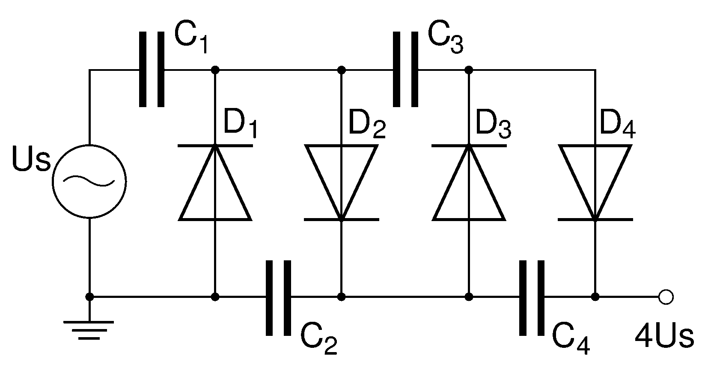

# Test


Blockdiag as a code block:

```
  ```blockdiag
  blockdiag {
    A -> B -> C -> D;
    A -> E -> F -> G;
  }
```
results in:

```blockdiag
blockdiag {
   A -> B -> C -> D;
   A -> E -> F -> G;
}
```


# Seqdiag

```seqdiag
seqdiag {
  browser  -> webserver [label = "GET /index.html"];
  browser <-- webserver;
  browser  -> webserver [label = "POST /blog/comment"];
              webserver  -> database [label = "INSERT comment"];
              webserver <-- database;
  browser <-- webserver;
}
```
# Actdiag

```actdiag
actdiag {
  write -> convert -> image

  lane user {
     label = "User"
     write [label = "Writing reST"];
     image [label = "Get diagram IMAGE"];
  }
  lane actdiag {
     convert [label = "Convert reST to Image"];
  }
}
```


```{.nwdiag #whatever caption="NWDIAG" width=35%}
nwdiag {
  network dmz {
      address = "210.x.x.x/24"

      web01 [address = "210.x.x.1"];
      web02 [address = "210.x.x.2"];
  }
  network internal {
      address = "172.x.x.x/24";

      web01 [address = "172.x.x.1"];
      web02 [address = "172.x.x.2"];
      db01;
      db02;
  }
}
```


```c
#include <stdio.h>

int main(){
    s = socket();
}
```
